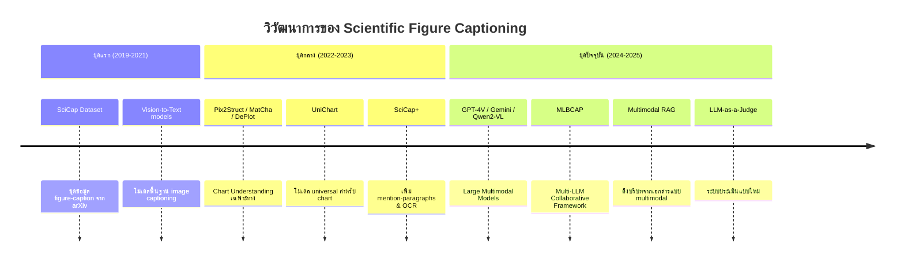
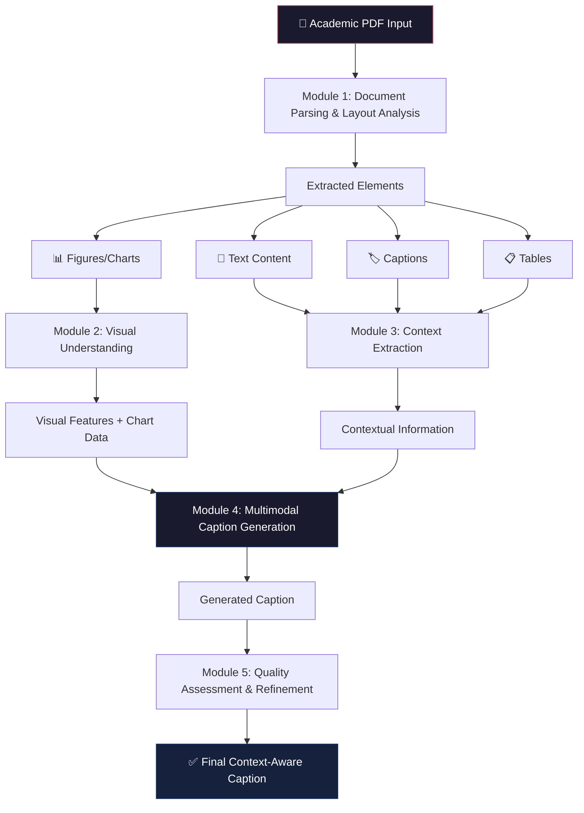
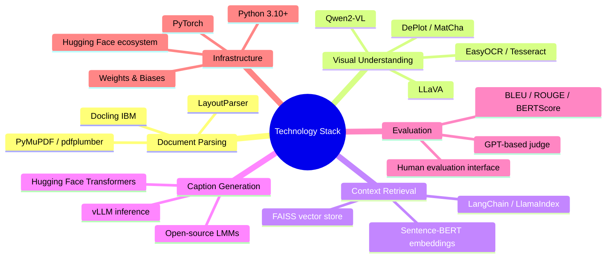
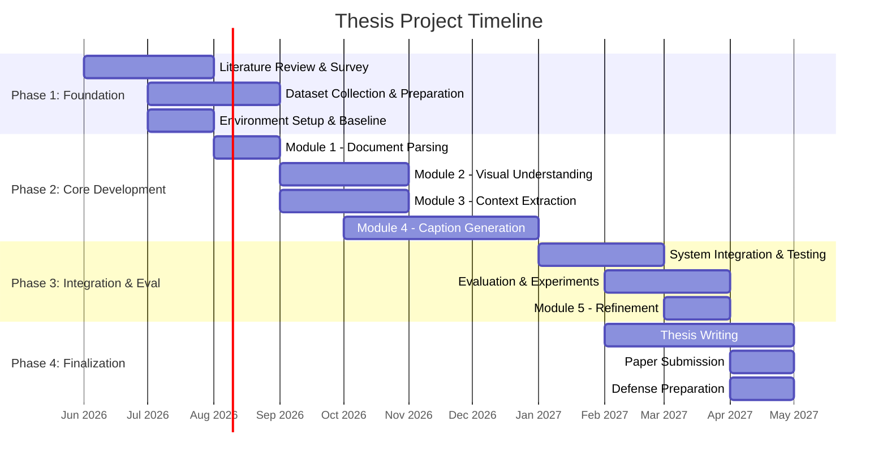
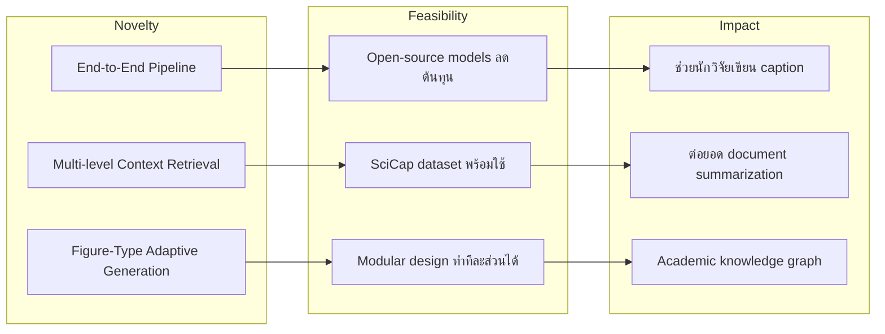

# 📋 แผน Direction โปรเจ็ควิทยานิพนธ์

> **หัวข้อ:** การสร้างคำอธิบายรูปภาพและกราฟในเอกสารวิชาการโดยใช้บริบทจากเนื้อหาเอกสาร  
> **Thesis Title (EN):** Context-Aware Caption Generation for Figures and Charts in Academic Documents  
> **อาจารย์ที่ปรึกษา:** ผู้ช่วยศาสตราจารย์ ดร. หัชทัย ชาญเลขา  

---

## 1. 🔑 Research Keywords

### Primary Keywords
| ลำดับ | Keyword (EN) | คำอธิบาย |
|:---:|:---|:---|
| 1 | **Scientific Figure Captioning** | การสร้างคำอธิบายรูปภาพทางวิชาการ — core task ของงานวิจัย |
| 2 | **Context-Aware Caption Generation** | การสร้างคำอธิบายโดยใช้บริบทจากเนื้อหาเอกสารร่วมด้วย |
| 3 | **Multimodal Learning** | การเรียนรู้ข้ามโมดาลิตี้ (ภาพ + ข้อความ) |
| 4 | **Document Layout Analysis** | การวิเคราะห์โครงสร้างเอกสาร เพื่อแยกองค์ประกอบต่าง ๆ |
| 5 | **Chart Understanding** | การทำความเข้าใจกราฟ/แผนภูมิจากภาพ |

### Secondary Keywords
| ลำดับ | Keyword (EN) | คำอธิบาย |
|:---:|:---|:---|
| 6 | **Large Multimodal Models (LMMs)** | โมเดลขนาดใหญ่ที่ประมวลผลได้หลาย modality |
| 7 | **Vision-Language Models (VLMs)** | โมเดลที่เชื่อมโยงการมองเห็นกับภาษา |
| 8 | **OCR (Optical Character Recognition)** | การรู้จำตัวอักษรจากภาพ (ใช้อ่านข้อความในกราฟ) |
| 9 | **Retrieval-Augmented Generation (RAG)** | การดึงข้อมูลมาเสริมการสร้างคำอธิบาย |
| 10 | **Knowledge-Augmented Captioning** | การใช้องค์ความรู้จากเอกสารเสริมการสร้างคำบรรยาย |

### Domain-Specific Keywords
| ลำดับ | Keyword (EN) | คำอธิบาย |
|:---:|:---|:---|
| 11 | **Academic Document Understanding** | การทำความเข้าใจเอกสารวิชาการ |
| 12 | **Figure-Mention Paragraph Extraction** | การดึงย่อหน้าที่กล่าวถึงรูปภาพ |
| 13 | **Chart-to-Text / Chart Summarization** | การสรุปกราฟให้เป็นข้อความ |
| 14 | **Multimodal Document Parsing** | การแยกวิเคราะห์เอกสารหลาย modality |
| 15 | **Hallucination Mitigation** | การลดการสร้างข้อมูลที่ไม่ตรงกับความจริงจากโมเดล |

### Evaluation Keywords
| ลำดับ | Keyword (EN) | คำอธิบาย |
|:---:|:---|:---|
| 16 | **BLEU / ROUGE / METEOR** | Metric สำหรับวัดคุณภาพข้อความที่สร้างขึ้น |
| 17 | **BERTScore** | Metric เชิง semantic ที่ใช้ embedding เปรียบเทียบ |
| 18 | **LLM-as-a-Judge** | การใช้ LLM ในการประเมินคุณภาพ (แนวโน้มใหม่) |
| 19 | **Faithfulness Evaluation** | การประเมินความถูกต้องตรงกับข้อมูลต้นฉบับ |
| 20 | **Human Evaluation** | การประเมินโดยผู้เชี่ยวชาญ |

---

## 2. 🌐 Related Work Landscape

### 2.1 ภาพรวมวิวัฒนาการของงานวิจัย

### 2.2 งานวิจัยที่เกี่ยวข้องโดยตรง

| Paper / Framework | ปี | แนวคิดหลัก | จุดเด่น | ข้อจำกัด |
|:---|:---:|:---|:---|:---|
| **SciCap** (Hsu et al.) | 2021 | ชุดข้อมูล figure-caption จาก arXiv 290K+ papers | ฐานข้อมูลใหญ่, มาตรฐานสำหรับ benchmark | เน้น single-panel graph plots เท่านั้น |
| **SciCap+** | 2023 | เพิ่ม mention-paragraphs + OCR tokens | ใช้บริบทจากเอกสารร่วม | ยังจำกัดเฉพาะ CS domain |
| **MLBCAP** | 2025 | Multi-LLM pipeline: assess → generate → judge | ชนะ SciCap Challenge, ดีกว่า human captions | ต้นทุนสูง (ใช้หลาย LLM), ต้อง GPT-4o |
| **DePlot** (Google) | 2023 | Plot → Table → LLM reasoning | แปลงกราฟเป็นตาราง แล้วให้ LLM สรุป | เหมาะกับกราฟแบบง่าย ๆ |
| **MatCha** (Google) | 2023 | Math + Chart derendering pretraining | Numerical reasoning ดี | ขนาดโมเดลใหญ่ |
| **UniChart** | 2023 | Universal chart comprehension | ทำได้หลาย task ในโมเดลเดียว | ยังมี hallucination |
| **CompCap** | 2024 | Synthetic data สำหรับ composite figures | รองรับภาพ multi-panel | ข้อมูล synthetic อาจไม่ตรงกับ real-world |
| **Docling** (IBM) | 2025 | Deep PDF parsing → structured format | แปลง PDF ได้ครบถ้วน, เก็บ layout | เน้น extraction ไม่ได้ทำ captioning |

### 2.3 Research Gap ที่ยังเปิดอยู่

> [!IMPORTANT]
> **Research Gaps ที่โปรเจ็คนี้สามารถ address ได้:**

1. **Context Integration Gap** — งานส่วนใหญ่ใช้เฉพาะ mention-paragraph แต่ไม่ได้ใช้ full document context (abstract, introduction, methodology ที่เกี่ยวข้อง)
2. **Multi-Figure Type Gap** — งานส่วนใหญ่เน้น chart/graph แต่ยังขาดการรองรับ architecture diagrams, flowcharts, experimental setups
3. **Non-English Gap** — ชุดข้อมูลและโมเดลส่วนใหญ่เน้นภาษาอังกฤษ ยังไม่มีงานสำหรับเอกสารวิชาการภาษาไทย
4. **End-to-End Pipeline Gap** — ยังไม่มี pipeline ที่ครบจาก PDF → Layout Analysis → Context Extraction → Caption Generation
5. **Evaluation Gap** — Metric แบบเดิม (BLEU/ROUGE) ไม่เหมาะกับงานนี้ ต้องการ evaluation framework ที่วัด faithfulness + context relevance

---

## 3. 🏗️ Proposed Methodology & Architecture

### 3.1 System Pipeline Overview

### 3.2 รายละเอียดแต่ละ Module

#### Module 1: Document Parsing & Layout Analysis
- **เป้าหมาย:** แยกองค์ประกอบจาก PDF (ภาพ, ข้อความ, ตาราง, caption)
- **เครื่องมือ/แนวทาง:**
  - `Docling` (IBM) — แปลง PDF เป็น structured JSON/Markdown
  - `DocLayNet` / `LayoutParser` — ตรวจจับ layout elements
  - `DocLayout-YOLO` — object detection สำหรับ document elements
- **Output:** structured document representation พร้อม bounding boxes

#### Module 2: Visual Understanding
- **เป้าหมาย:** วิเคราะห์เนื้อหาภาพ/กราฟ
- **แนวทาง:**
  - จำแนกประเภทภาพ (graph, diagram, photo, flowchart)
  - ดึง OCR tokens จากภาพ
  - Chart derendering (แปลงกราฟเป็นตาราง/ข้อมูล) ด้วย DePlot/MatCha
  - ใช้ VLM (เช่น Qwen2-VL, LLaVA) สำหรับ initial visual description
- **Output:** visual features, chart data table, OCR tokens, figure type

#### Module 3: Context Extraction
- **เป้าหมาย:** ดึงบริบทที่เกี่ยวข้องกับรูปภาพจากเนื้อหาเอกสาร
- **แนวทาง:**
  - **Mention-Paragraph Extraction:** ค้นหาย่อหน้าที่กล่าวถึงรูปภาพ (เช่น "Figure 1", "as shown in Fig. 2")
  - **Semantic Retrieval:** ใช้ RAG เพื่อดึงส่วนของเอกสารที่เกี่ยวข้องเชิงความหมาย
  - **Section-Aware Context:** พิจารณาว่ารูปอยู่ใน section ไหน (Methodology, Results, etc.)
  - **Cross-Reference Resolution:** เชื่อมโยงตารางและรูปภาพที่เกี่ยวข้องกัน
- **Output:** ranked context passages, section info, cross-references

#### Module 4: Multimodal Caption Generation
- **เป้าหมาย:** สร้างคำอธิบายที่รวม visual + contextual information
- **แนวทางที่เป็นไปได้ (เลือก 1 หรือเปรียบเทียบ):**

| แนวทาง | รายละเอียด | ข้อดี | ข้อเสีย |
|:---|:---|:---|:---|
| **A: Prompt-based LMM** | ใช้ LMM (GPT-4V, Gemini) โดยออกแบบ prompt ที่รวม visual + context | ง่าย, ใช้ความสามารถของโมเดลใหญ่ | ต้นทุนสูง, ไม่ reproduce ง่าย |
| **B: Fine-tuned VLM** | Fine-tune โมเดล open-source (Qwen2-VL, LLaVA) บน SciCap+ | ควบคุมได้, reproduce ได้ | ต้องการ GPU, ข้อมูลเยอะ |
| **C: Multi-LLM Pipeline** | ใช้หลาย LLM ทำงานร่วมกัน (แบบ MLBCAP) | คุณภาพสูง | ซับซ้อน, ต้นทุนสูง |
| **D: Hybrid RAG + VLM** | ใช้ RAG ดึง context แล้วส่งให้ VLM สร้าง caption | สมดุลระหว่างคุณภาพและต้นทุน | ต้องออกแบบ retrieval ดี |

> [!TIP]
> **แนะนำ: แนวทาง D (Hybrid RAG + VLM)** เหมาะสมที่สุดสำหรับวิทยานิพนธ์ เพราะมีความเป็น novel (ยังไม่มีใครทำ end-to-end แบบนี้), สามารถใช้ open-source models ได้, และมี contribution ที่ชัดเจนทั้งในส่วน retrieval และ generation

#### Module 5: Quality Assessment & Refinement
- **เป้าหมาย:** ตรวจสอบและปรับปรุงคุณภาพ caption
- **แนวทาง:**
  - Faithfulness checking (ตรวจว่า caption ตรงกับข้อมูลในภาพจริง ๆ)
  - Context relevance scoring (ตรวจว่า caption สอดคล้องกับบริบทเอกสาร)
  - Iterative refinement ด้วย self-correction

---

## 4. 📊 Datasets & Benchmarks

| Dataset | ขนาด | เนื้อหา | การใช้งาน |
|:---|:---|:---|:---|
| **SciCap** | 133K+ pairs | Figure-caption จาก arXiv CS papers | Training & Evaluation หลัก |
| **SciCap+** | 133K+ pairs | + mention-paragraphs + OCR tokens | Context-aware training |
| **ArXivCap** | Millions | Multimodal ArXiv figure-caption pairs | Pretraining / Large-scale eval |
| **Chart-to-Text** (Pew/Statista) | ~44K | Chart summarization pairs | Chart-specific evaluation |
| **DocLayNet** | 80K+ pages | Document layout annotations | Layout analysis training |
| **Custom Dataset** | TBD | เอกสารวิชาการภาษาไทย (ถ้ามี) | Domain extension |

---

## 5. 🛠️ Technology Stack

---

## 6. 📅 Proposed Timeline

> [!NOTE]
> Timeline ด้านล่างเป็นแนวทางคร่าว ๆ สำหรับแผนวิทยานิพนธ์ 1 ปี สามารถปรับได้ตามความเหมาะสม

### Phase Details

| Phase | ระยะเวลา | กิจกรรมหลัก | Deliverables |
|:---|:---|:---|:---|
| **Phase 1: Foundation** | เดือน 1-2 | ศึกษางานวิจัย, เตรียมข้อมูล, ตั้ง baseline | Literature review, Dataset, Baseline results |
| **Phase 2: Core Dev** | เดือน 3-7 | พัฒนาแต่ละ Module | Working modules, Intermediate results |
| **Phase 3: Integration** | เดือน 8-10 | รวมระบบ, ทดลอง, ประเมินผล | Complete system, Evaluation results |
| **Phase 4: Finalize** | เดือน 9-12 | เขียนวิทยานิพนธ์, ส่ง paper, สอบ | Thesis document, Published paper |

---

## 7. 🎯 Expected Contributions

### Academic Contributions
1. **End-to-End Pipeline** สำหรับ context-aware figure captioning ที่ครอบคลุมตั้งแต่ PDF parsing จนถึง caption generation
2. **Context Retrieval Framework** ที่ออกแบบเฉพาะสำหรับการดึงบริบทที่เกี่ยวข้องกับรูปภาพในเอกสารวิชาการ
3. **Evaluation Framework** ที่วัดทั้ง faithfulness, context relevance, และ academic informativeness
4. **Comparative Study** ระหว่างแนวทางต่าง ๆ (prompt-based vs fine-tuned vs hybrid)

### Practical Contributions
1. **Tool/Library** ที่สามารถใช้สร้างคำอธิบายรูปภาพใน paper ได้โดยอัตโนมัติ
2. **Dataset Annotations** (ถ้าสร้างชุดข้อมูลใหม่)
3. สามารถต่อยอดไปยัง **Document Summarization** และ **Academic Knowledge Management**

---

## 8. 🧭 Recommended Research Direction

> [!IMPORTANT]
> **Direction หลักที่แนะนำ:**

### Direction: Hybrid RAG + Open-Source VLM for Context-Aware Scientific Figure Captioning

### เหตุผลที่แนะนำ Direction นี้:
1. **Novel Enough** — ยังไม่มีใครทำ end-to-end pipeline ที่ใช้ RAG + VLM สำหรับ context-aware captioning แบบครบวงจร
2. **Feasible** — ใช้ open-source models (Qwen2-VL, LLaVA) + existing datasets (SciCap+) ลดต้นทุนและเวลา
3. **Publishable** — มีโอกาสส่ง paper ใน venues เช่น EMNLP, ACL, AAAI Workshops
4. **Extensible** — สามารถต่อยอดได้หลายทาง (Thai academic docs, domain-specific, knowledge graphs)

---

## 9. 🔬 Possible Experiments

| Experiment | เป้าหมาย | Input | Expected Output |
|:---|:---|:---|:---|
| **Exp 1: Baseline Comparison** | เปรียบเทียบ VLM ต่าง ๆ (image-only vs context-aware) | SciCap test set | BLEU, ROUGE, BERTScore |
| **Exp 2: Context Ablation** | วัดผลกระทบของแต่ละ level ของ context | ±mention-para, ±section, ±abstract | Performance delta per context level |
| **Exp 3: Figure Type Analysis** | ดูว่าโมเดลทำได้ดีกับรูปแบบไหน | แยกตามประเภทรูป | Per-type performance |
| **Exp 4: RAG vs Full Context** | เปรียบเทียบ retrieval vs ส่ง full text | Same figures | Quality + latency |
| **Exp 5: Human Evaluation** | ให้ผู้เชี่ยวชาญประเมิน | Generated vs original captions | Preference scores |
| **Exp 6: LLM-as-a-Judge** | ใช้ LLM ประเมินแทน human | Generated captions | Correlation with human scores |

---

## 10. 📚 Key References to Read First

> [!TIP]
> **เริ่มจาก 5 papers นี้ก่อน (เรียงตามลำดับความสำคัญ):**

1. **SciCap: Generating Captions for Scientific Figures** (Hsu et al., 2021) — ฐานของทั้งหมด
2. **MLBCAP: Multi-LLM Collaborative Figure Caption Generation** (AAAI 2025 Workshop) — State-of-the-art framework
3. **DePlot: One-shot Plot-to-Table Translation** (Google, 2023) — Chart understanding approach
4. **SciCap+: A Knowledge-Augmented Dataset** — Context-aware baseline
5. **Survey on Chart Understanding using MLLMs** (2024-2025) — ภาพรวมของ field

### Additional References by Topic
- **Document Layout Analysis:** DocLayNet, DLAFormer, DocLayout-YOLO
- **Vision-Language Models:** LLaVA, Qwen2-VL, InternVL
- **Chart Models:** MatCha, UniChart, ChartInstruct
- **RAG for Documents:** Multimodal RAG surveys, LangChain documentation
- **Evaluation:** BERTScore paper, LLM-as-a-Judge methodology papers

---

> [!NOTE]
> เอกสารนี้เป็น **living document** สามารถปรับเปลี่ยนได้ตามความคืบหน้าของงานวิจัย แนะนำให้ update ทุก 2-4 สัปดาห์
